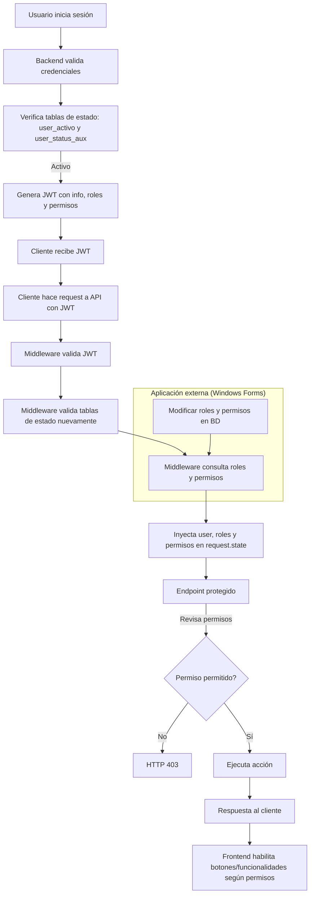

¡Perfecto! Te voy a generar toda la documentación de tu sistema de seguridad y permisos para que quede lista en **Markdown**, lista para colocar en tu repositorio o documentación interna. Incluiré:

* Flujo de autenticación y autorización
* Middleware
* Tablas de base de datos
* Ejemplos de endpoints
* Diagrama Mermaid

---

# Sistema de Seguridad y Permisos para API FastAPI

## 1. Autenticación y JWT

1. El usuario ingresa su correo y contraseña en la aplicación (web o Windows Forms).
2. Backend valida:

   * Usuario existe y contraseña correcta.
   * Usuario activo en **tabla principal** (`usuarios`) y en **tabla secundaria** (`user_activo` o `user_status_aux`).
3. Backend genera **JWT** con los siguientes datos:

   ```json
   {
     "sub": "email",
     "id": 1,
     "nombre": "John Doe",
     "is_active": true,
     "env": "development",
     "roles": ["admin"]
   }
   ```
4. JWT se devuelve al cliente.

---

## 2. Middleware centralizado

Todas las solicitudes pasan por un middleware que realiza:

1. Extrae el token del header `Authorization`.
2. Valida el JWT (firma y expiración).
3. Consulta **ambas tablas de estado** y bloquea usuarios inactivos.
4. Consulta **roles del usuario** (`usuario_roles`).
5. Consulta **permisos efectivos** (`rol_permisos`) según roles.
6. Inyecta en `request.state.user` la siguiente información:

   ```json
   {
     "id": 1,
     "nombre": "John Doe",
     "email": "johndoe@example.com",
     "roles": ["admin"],
     "permisos": ["crear_producto", "ver_productos", "eliminar_producto"]
   }
   ```

### Middleware Ejemplo en FastAPI

```python
from fastapi import Request, HTTPException
from starlette.middleware.base import BaseHTTPMiddleware
from jose import jwt, JWTError
from sqlalchemy.ext.asyncio import AsyncSession
import sqlalchemy as sa

class AuthMiddleware(BaseHTTPMiddleware):
    def __init__(self, app, db_session: AsyncSession, excluded_paths: list = None):
        super().__init__(app)
        self.db_session = db_session
        self.excluded_paths = excluded_paths or ["/auth/login", "/auth/register"]

    async def dispatch(self, request: Request, call_next):
        if any(request.url.path.startswith(path) for path in self.excluded_paths):
            return await call_next(request)

        auth_header = request.headers.get("Authorization")
        if not auth_header or not auth_header.startswith("Bearer "):
            raise HTTPException(status_code=401, detail="Token faltante")

        token = auth_header.split(" ")[1]
        try:
            payload = jwt.decode(token, get_actual_secret(), algorithms=[ALGORITHM])
        except JWTError:
            raise HTTPException(status_code=401, detail="Token inválido")

        user_id = payload.get("id")

        async with self.db_session.begin():
            result1 = await self.db_session.execute(
                sa.text("SELECT is_active FROM user_activo WHERE id_usuario = :id"), {"id": user_id}
            )
            ua = result1.mappings().first()

            result2 = await self.db_session.execute(
                sa.text("SELECT is_active FROM user_status_aux WHERE usuario_id = :id"), {"id": user_id}
            )
            aux = result2.mappings().first()

            result_roles = await self.db_session.execute(
                sa.text("""
                    SELECT r.nombre
                    FROM roles r
                    JOIN usuario_roles ur ON r.id = ur.rol_id
                    WHERE ur.usuario_id = :id
                """), {"id": user_id}
            )
            roles = [r["nombre"] for r in result_roles.mappings().all()]

            result_permisos = await self.db_session.execute(
                sa.text("""
                    SELECT p.nombre
                    FROM permisos p
                    JOIN rol_permisos rp ON p.id = rp.permiso_id
                    JOIN usuario_roles ur ON ur.rol_id = rp.rol_id
                    WHERE ur.usuario_id = :id
                """), {"id": user_id}
            )
            permisos = [p["nombre"] for p in result_permisos.mappings().all()]

        if not ua or not aux or not (ua["is_active"] and aux["is_active"]):
            raise HTTPException(status_code=403, detail="Usuario inactivo")

        request.state.user = {
            "id": user_id,
            "nombre": payload.get("nombre"),
            "email": payload.get("sub"),
            "roles": roles,
            "permisos": permisos
        }

        return await call_next(request)
```

---

## 3. Tablas de Base de Datos

### Usuarios y Estado

```sql
CREATE TABLE usuarios (
    id SERIAL PRIMARY KEY,
    nombre VARCHAR(100),
    email VARCHAR(100) UNIQUE,
    password VARCHAR(255)
);

CREATE TABLE user_activo (
    id SERIAL PRIMARY KEY,
    id_usuario INT REFERENCES usuarios(id),
    is_active BOOLEAN NOT NULL DEFAULT TRUE,
    fecha_registro TIMESTAMP DEFAULT NOW()
);

CREATE TABLE user_status_aux (
    id SERIAL PRIMARY KEY,
    usuario_id INT REFERENCES usuarios(id),
    is_active BOOLEAN NOT NULL DEFAULT TRUE
);
```

### Roles y Permisos

```sql
CREATE TABLE roles (
    id SERIAL PRIMARY KEY,
    nombre VARCHAR(50) UNIQUE NOT NULL
);

CREATE TABLE permisos (
    id SERIAL PRIMARY KEY,
    nombre VARCHAR(50) UNIQUE NOT NULL,
    descripcion TEXT
);

CREATE TABLE rol_permisos (
    id SERIAL PRIMARY KEY,
    rol_id INT REFERENCES roles(id) ON DELETE CASCADE,
    permiso_id INT REFERENCES permisos(id) ON DELETE CASCADE,
    UNIQUE (rol_id, permiso_id)
);

CREATE TABLE usuario_roles (
    id SERIAL PRIMARY KEY,
    usuario_id INT REFERENCES usuarios(id) ON DELETE CASCADE,
    rol_id INT REFERENCES roles(id) ON DELETE CASCADE,
    UNIQUE (usuario_id, rol_id)
);
```

---

## 4. Ejemplo de Endpoint Protegido

```python
from fastapi import Request, HTTPException, APIRouter

router = APIRouter(prefix="/productos", tags=["productos"])

@router.post("/crear")
async def crear_producto(request: Request):
    user = request.state.user
    if "crear_producto" not in user["permisos"]:
        raise HTTPException(status_code=403, detail="No tiene permiso para crear productos")
    return {"mensaje": f"Producto creado por {user['nombre']}"}

@router.get("/")
async def listar_productos(request: Request):
    user = request.state.user
    if "ver_productos" not in user["permisos"]:
        raise HTTPException(status_code=403, detail="No tiene permiso para ver productos")
    return {"mensaje": f"Productos listados para {user['nombre']}"}
```

---

## 5. Frontend / Cliente

* Se reciben los roles y permisos desde la API.
* Se habilitan/deshabilitan botones según permisos.

**Ejemplo React:**

```tsx
{user.permisos.includes("crear_producto") ? (
    <button>Crear Producto</button>
) : (
    <button disabled>Crear Producto</button>
)}
```

**Ejemplo Windows Forms (C#):**

```csharp
btnCrearProducto.Enabled = user.Permisos.Contains("crear_producto");
```

---

## 6. Diagrama de Flujo (Mermaid)



---

✅ **Resumen**

1. Todos los endpoints pasan por **middleware centralizado**.
2. Se valida **JWT** y **estado activo** en ambas tablas.
3. Se consultan **roles y permisos**.
4. Backend garantiza seguridad real; frontend solo habilita UI según permisos.
5. Roles y permisos pueden ser administrados desde otro programa externo.

---