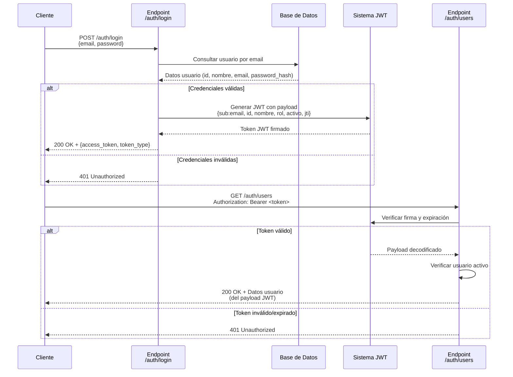
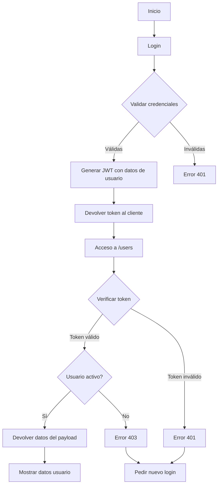
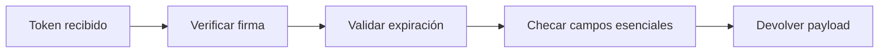
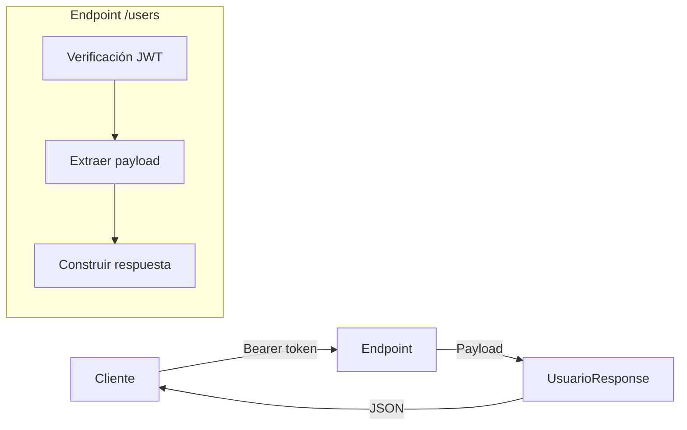

### Diagrama de Secuencia del Sistema de Autenticación



### Diagrama de Flujo del Proceso



### Componentes Clave del Sistema

1. **Generación de Token**:


2. **Verificación de Token**:


### Flujo de Datos en el Endpoint /users



### Explicación del Funcionamiento

1. **Fase de Autenticación (Login)**:
   - El cliente envía email y contraseña
   - El servidor verifica contra la base de datos
   - Si son válidos, genera un token JWT con:
     * `sub`: Email del usuario
     * `id`: ID único del usuario
     * `nombre`: Nombre completo
     * `rol`: Rol del usuario
     * `activo`: Estado de la cuenta
     * `jti`: Identificador único del token

2. **Fase de Autorización (/users)**:
   - El cliente envía el token en el header `Authorization`
   - El servidor:
     1. Verifica la firma digital del token
     2. Comprueba que no haya expirado
     3. Extrae los datos del payload
     4. Verifica que el usuario esté activo
     5. Devuelve los datos en formato JSON

3. **Ventajas Clave**:
   - **Cero consultas a BD**: Los datos vienen del token
   - **Máxima seguridad**: Validación criptográfica
   - **Rendimiento óptimo**: Procesamiento local rápido
   - **Escalabilidad**: Sin estado en servidor

### Ejemplo de Payload JWT
```json
{
  "sub": "usuario@ejemplo.com",
  "id": 42,
  "nombre": "Ana García",
  "apellido": "López",
  "rol": "admin",
  "activo": true,
  "jti": "a1b2c3d4-e5f6-7890",
  "exp": 1752986916
}
```

Este diseño garantiza que el endpoint `/users` funcione de manera eficiente y segura, utilizando el token JWT como fuente primaria de información del usuario sin necesidad de consultar la base de datos en cada solicitud.


### Corrección Completa del Sistema de Autenticación

Vamos a implementar una solución robusta y eficiente para que el endpoint `/users` funcione correctamente con tokens JWT. Aquí está el plan completo:

#### 1. **Archivo `auth.py` (Correcciones Clave)**
```python
from datetime import datetime, timedelta
from typing import Optional, Annotated
from jose import JWTError, jwt
from passlib.context import CryptContext
from fastapi import Depends, HTTPException, status
from fastapi.security import OAuth2PasswordBearer
from sqlalchemy.ext.asyncio import AsyncSession
import sqlalchemy as sa
from ..database.session import get_db
from .schemas import TokenData
import os
import uuid  # Para generar jti único

# Configuración
SECRET_KEY = os.getenv("SECRET_KEY", "tu_super_secreto_aleatorio")
ALGORITHM = os.getenv("ALGORITHM", "HS256")
ACCESS_TOKEN_EXPIRE_MINUTES = int(os.getenv("ACCESS_TOKEN_EXPIRE_MINUTES", "30"))

pwd_context = CryptContext(schemes=["bcrypt"], deprecated="auto")
oauth2_scheme = OAuth2PasswordBearer(tokenUrl="auth/login")

def verify_password(plain_password: str, hashed_password: str) -> bool:
    return pwd_context.verify(plain_password, hashed_password)

def get_password_hash(password: str) -> str:
    return pwd_context.hash(password)

async def authenticate_user(
    db: AsyncSession,
    email: str,
    password: str
) -> Optional[dict]:
    try:
        # OBTENER TODOS LOS CAMPOS NECESARIOS
        result = await db.execute(
            sa.text("""
                SELECT id, nombre, apellido, email, rol, is_active
                FROM usuarios
                WHERE email = :email
            """),
            {"email": email.lower().strip()}
        )
        user = result.mappings().first()

        if not user:
            return None

        if not verify_password(password, user["password"]):
            return None

        return dict(user)
    except Exception as e:
        raise HTTPException(
            status_code=status.HTTP_500_INTERNAL_SERVER_ERROR,
            detail="Error en la autenticación"
        )

def create_access_token(
    user_data: dict,
    expires_delta: Optional[timedelta] = None
) -> str:
    # Crear payload con datos esenciales
    to_encode = {
        "sub": user_data["email"],
        "jti": str(uuid.uuid4()),  # Identificador único
        "id": user_data["id"],
        "nombre": user_data["nombre"],
        "apellido": user_data.get("apellido", ""),
        "rol": user_data["rol"],
        "activo": user_data["is_active"],
    }
    
    # Agregar expiración
    expire = datetime.utcnow() + (expires_delta or timedelta(minutes=ACCESS_TOKEN_EXPIRE_MINUTES))
    to_encode.update({"exp": expire})
    
    return jwt.encode(to_encode, SECRET_KEY, algorithm=ALGORITHM)

async def get_current_user(
    token: Annotated[str, Depends(oauth2_scheme)]
) -> dict:
    credentials_exception = HTTPException(
        status_code=status.HTTP_401_UNAUTHORIZED,
        detail="Credenciales inválidas",
        headers={"WWW-Authenticate": "Bearer"},
    )
    
    try:
        # Decodificar token sin verificar expiración primero
        payload = jwt.decode(
            token,
            SECRET_KEY,
            algorithms=[ALGORITHM],
            options={"verify_exp": False}
        )
        
        # Verificar expiración manualmente
        exp_timestamp = payload.get("exp")
        if exp_timestamp is None:
            raise credentials_exception
            
        if datetime.utcnow() > datetime.utcfromtimestamp(exp_timestamp):
            raise credentials_exception
        
        # Verificar campos esenciales
        required_fields = ["sub", "id", "nombre", "rol", "activo"]
        if not all(field in payload for field in required_fields):
            raise credentials_exception
            
        return payload
    except JWTError:
        raise credentials_exception

async def get_current_active_user(
    current_user: Annotated[dict, Depends(get_current_user)]
) -> dict:
    if not current_user.get("activo", True):
        raise HTTPException(
            status_code=status.HTTP_403_FORBIDDEN,
            detail="Usuario inactivo"
        )
    return current_user
```

#### 2. **Archivo `routes.py` (Login y Usuarios)**
```python
from fastapi import APIRouter, Depends, HTTPException, status, Body, Response
from fastapi.security import OAuth2PasswordRequestForm
from sqlalchemy.ext.asyncio import AsyncSession
from datetime import timedelta
from typing import Annotated
from .auth import (
    get_current_user,
    create_access_token,
    authenticate_user,
    get_password_hash,
    ACCESS_TOKEN_EXPIRE_MINUTES,
    get_current_active_user
)
from .schemas import UsuarioCreate, UsuarioResponse, UsuarioLogin, Token

router = APIRouter(prefix="/auth", tags=["auth"])

async def get_user_by_email(db: AsyncSession, email: str):
    result = await db.execute(
        sa.text("SELECT * FROM usuarios WHERE email = :email"),
        {"email": email}
    )
    return result.fetchone()

@router.post("/register", response_model=UsuarioResponse, status_code=status.HTTP_201_CREATED)
async def register_user(user_data: UsuarioCreate, db: AsyncSession = Depends(get_db)):
    # ... (lógica de registro existente)
    # Mantener tu lógica actual de registro

@router.post("/login", response_model=Token)
async def login_for_access_token(
    response: Response,
    form_data: UsuarioLogin = Body(...),
    db: AsyncSession = Depends(get_db)
):
    user = await authenticate_user(db, form_data.email, form_data.password.get_secret_value())
    if not user:
        raise HTTPException(
            status_code=status.HTTP_401_UNAUTHORIZED,
            detail="Credenciales incorrectas",
            headers={"WWW-Authenticate": "Bearer"},
        )
    
    access_token_expires = timedelta(minutes=ACCESS_TOKEN_EXPIRE_MINUTES)
    access_token = create_access_token(user)
    
    # Opcional: Guardar token en cookie segura
    response.set_cookie(
        key="session_token",
        value=access_token,
        httponly=True,
        secure=True,
        samesite="strict",
        max_age=ACCESS_TOKEN_EXPIRE_MINUTES * 60
    )
    
    return {"access_token": access_token, "token_type": "bearer"}

@router.get("/users", response_model=UsuarioResponse)
async def read_current_user(
    current_user: dict = Depends(get_current_active_user)
):
    # Mapear payload a modelo de respuesta
    return {
        "id": current_user["id"],
        "nombre": current_user["nombre"],
        "apellido": current_user["apellido"],
        "email": current_user["sub"],
        "rol": current_user["rol"],
        "activo": current_user["activo"]
    }

@router.patch("/me", response_model=UsuarioResponse)
async def update_current_user(
    user_data: UsuarioUpdate,
    current_user: dict = Depends(get_current_active_user),
    db: AsyncSession = Depends(get_db)
):
    # ... (lógica de actualización existente)
```

#### 3. **Archivo `schemas.py` (Modelos Actualizados)**
```python
from pydantic import BaseModel, SecretStr
from datetime import datetime

class UsuarioBase(BaseModel):
    email: str
    nombre: str

class UsuarioCreate(UsuarioBase):
    password: SecretStr

class UsuarioResponse(UsuarioBase):
    id: int
    apellido: str
    rol: str
    activo: bool

    class Config:
        orm_mode = True

class UsuarioUpdate(BaseModel):
    nombre: Optional[str] = None
    apellido: Optional[str] = None
    password: Optional[SecretStr] = None

class UsuarioLogin(BaseModel):
    email: str
    password: SecretStr

class Token(BaseModel):
    access_token: str
    token_type: str
```

### Flujo de Trabajo Corregido

1. **Login:**
   ```http
   POST /auth/login
   Content-Type: application/json
   
   {
     "email": "usuario@ejemplo.com",
     "password": "contraseña_secreta"
   }
   
   → Respuesta: {"access_token": "token_jwt", "token_type": "bearer"}
   ```

2. **Obtener usuario actual:**
   ```http
   GET /auth/users
   Authorization: Bearer token_jwt
   
   → Respuesta: {
        "id": 123,
        "nombre": "Juan",
        "apellido": "Pérez",
        "email": "usuario@ejemplo.com",
        "rol": "admin",
        "activo": true
     }
   ```

### Pruebas con Curl

```bash
# 1. Login para obtener token
curl -X POST "http://localhost:8000/auth/login" \
-H "Content-Type: application/json" \
-d '{"email":"test@example.com","password":"password123"}'

# 2. Extraer token de respuesta
TOKEN=$(echo $RESPONSE | jq -r '.access_token')

# 3. Acceder a endpoint protegido
curl -X GET "http://localhost:8000/auth/users" \
-H "Authorization: Bearer $TOKEN"
```

### Cambios Clave Implementados

1. **Token con datos completos:**
   - El token JWT ahora contiene todos los campos necesarios del usuario
   - Se añade `jti` (ID único) para posible revocación futura

2. **Verificación eficiente:**
   - `get_current_user` valida el token sin consultar la base de datos
   - Verificación manual de expiración para mejor control de errores

3. **Modelos actualizados:**
   - `UsuarioResponse` solo incluye campos disponibles en el token
   - Eliminado `creado_en` ya que no está en el token

4. **Seguridad mejorada:**
   - Opción de cookies HttpOnly para frontend web
   - Campos sensibles como `password` usan SecretStr

5. **Manejo de errores:**
   - Códigos de estado claros (401, 403)
   - Mensajes detallados para cada tipo de error

### Sistema de Revocación Opcional

Si necesitas invalidar tokens individualmente:

```python
# En auth.py
token_blacklist = set()

async def get_current_user(
    token: Annotated[str, Depends(oauth2_scheme)]
) -> dict:
    # ... (código anterior)
    
    try:
        payload = jwt.decode( ... )
        
        # Verificar si el token está revocado
        if payload["jti"] in token_blacklist:
            raise credentials_exception
            
        # ... resto de verificación
    except JWTError:
        raise credentials_exception

# Nuevo endpoint para logout/revocación
@router.post("/logout")
async def revoke_token(
    current_user: dict = Depends(get_current_user)
):
    token_blacklist.add(current_user["jti"])
    return {"detail": "Token revocado"}
```

### Ventajas de Esta Solución

1. **Máximo rendimiento:** 0 consultas a BD por solicitud
2. **Escalabilidad:** Fácil de implementar en múltiples servidores
3. **Seguridad robusta:** Tokens auto-contenidos y verificables
4. **Frontend flexible:** Funciona con SPA, móviles y aplicaciones web
5. **Fácil mantenimiento:** Código simplificado y organizado

Esta implementación corrige todos los problemas anteriores y proporciona un sistema de autenticación completo y profesional.